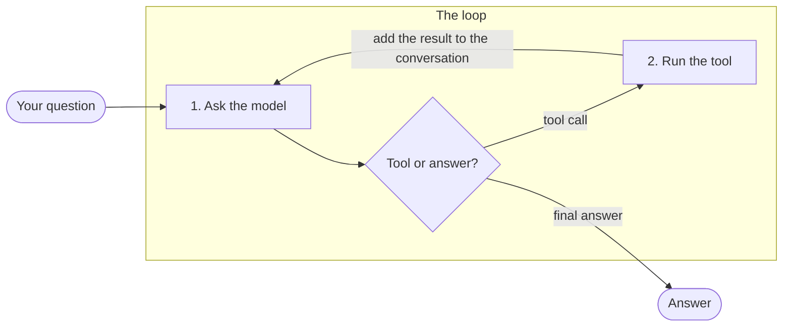

# nanoagent

A raw agent loop built from scratch — no framework. Just the request/response cycle, function calling, and a lightweight skills system, written in plain Python so every moving part stays visible.

## Why

Most people learn an agent framework before they understand what an agent loop actually is. This project inverts that: build the loop by hand first — the same way [nanoGPT](https://github.com/karpathy/nanoGPT) strips a language model down to its essentials — so that frameworks later become a productivity layer instead of a black box.

## How it works



This is the standard **tool-calling loop** (the "agent loop"): the model decides, we run the tool it asked for, we feed the result back, and it decides again. In ReAct terms, that is reason → act → observe, repeated until the model answers with text instead of a tool call. Every call to the model is also written to `logs/run.log`.

The "tool or answer?" decision reads the response's `finish_reason`:

| `finish_reason` | Meaning | What the loop does |
|---|---|---|
| `tool_calls` | The model wants one or more tools run | Run them, add each result as a `role: "tool"` message, ask again |
| `stop` | The model is done | Return the answer |
| `length` | The answer was cut off (token limit) | Warn and stop |

## What it demonstrates

- **Agent loop** — request → tool_calls → tool execution → re-injection → repeat, until the model signals it's done (`finish_reason == "stop"`)
- **Function calling**, OpenAI-compatible format, via [OpenRouter](https://openrouter.ai) — swap models with one variable, no code changes
- **Skills** — a minimal progressive-disclosure system. Only a skill's name and description sit in the system prompt; the model loads the full instructions on demand via a `load_skill` tool call. Same pattern Claude's own Skills use, reimplemented from first principles
- **Tool vs skill** — `load_skill` only returns text (context, no side effect), while `write_file` really changes the disk, so it is a tool. It never overwrites a report: if the file exists, it adds a timestamp to the name
- **Multi-context handoff** — chaining two agent calls with different system prompts and an explicit handoff between them, not a multi-agent framework

What it deliberately does **not** do: agent-to-agent communication, persistent memory, orchestration graphs. That's a different project.

### What multi-context cost, measured

`python main.py` and `python main.py multi` start from the same question with the same tools and skills. The catch is visible in the code: the second call receives only the text the first one produced, never the original question. That is the handoff, and it is also why a mistake in step one travels to step two unnoticed — a fresh context has no way to check what it was handed. An earlier measurement put the two-context version at roughly 40% more tokens, but it ran on a different free model and an earlier version of these demos; run-to-run variation on a free model is wide enough that quoting a single percentage today would be false precision. What the split reliably buys is per-stage logs and a second step that only has one job.

### What progressive disclosure costs, measured

Token counts are deterministic, so this part needs no benchmark — it is the `prompt_tokens`
the API reports for each system prompt, with everything else held equal:

| System prompt contains | Tokens | Paid |
|---|---|---|
| The base prompt alone | 97 | — |
| … plus both skill **descriptions** (on-demand) | 192 | **+95, every turn** |
| … plus both full skill **bodies** (upfront) | 363 | **+266, every turn** |

On-demand also pays for the `load_skill` schema (+27 every turn), and once a skill *is* loaded its
body enters the conversation and is re-sent on every later turn (153 tokens for
`income-statement-analysis`, 102 for `stock-report-format`). Counts are tokenizer-specific, so
they move when you change `MODEL`; these were measured on the default above.

So for the run above — 6 turns, both skills loaded early — loading on demand costs **more**
than pasting both skills in from the start. That is the honest result, and it is not a flaw:
a description is worth roughly 40% of its body here, so on-demand only wins once you leave a good
third of your skills unloaded, and it wins bigger the more you leave untouched. Two skills with both
loaded is the worst case for progressive disclosure. It pays off the way it does for Claude's own
Skills: dozens available, one or two used.

## Steps

| Step | What it adds | Where |
|---|---|---|
| 1 | A minimal call to the model through OpenRouter | `llm.py` |
| 2 | A tool declared as a schema | `tools.py` |
| 3 | Tool execution, `role: "tool"` messages, run logging | `tools.py`, `logger.py` |
| 4 | The loop and its stop conditions | `main.py` |
| 5 | A second tool | `tools.py` |
| 6 | Multi-context handoff | `prompts.py`, `main.py` |
| 7 | Skills with progressive loading | `skills.py`, `skills/` |
| 8 | Clean-up and publication | `README.md`, `.env.example` |

## Structure

```
nanoagent/
├── llm.py       # API call wrapper (OpenRouter, OpenAI-compatible)
├── tools.py     # tool schemas + execution (stock price, income statement, load_skill, write_file)
├── skills.py    # skill discovery + loading
├── prompts.py   # system prompts
├── logger.py    # lightweight run logging
├── skills/      # SKILL.md folders
├── logs/        # run.log, one JSON line per model call (created on first run)
├── reports/     # markdown written by the write_file tool (created on first run)
└── main.py      # the loop
```

## Run it

```bash
python --version                  # 3.10 or newer
pip install -r requirements.txt   # openai, python-dotenv, yfinance
cp .env.example .env              # add your OPENROUTER_API_KEY
python main.py                    # one context does the whole job
python main.py multi              # the same question, split over two contexts
```

Each turn prints one line, and the full entry (tool arguments, answer, tokens) goes to `logs/run.log`.
A real run of `python main.py`: the model pulls in the skill it needs to interpret the figures,
fetches them, pulls in the formatting skill, writes the report, and signs off.

```
→ openai/gpt-oss-20b
  [0] load_skill -> income-statement-analysis | 443→64 tokens (37 reasoning) | 0.43s
  [1] get_stock_price -> AAPL | 602→70 tokens (57 reasoning) | 0.56s
  [2] get_income_statement -> AAPL | 649→37 tokens (15 reasoning) | 0.73s
  [3] load_skill -> stock-report-format | 711→113 tokens (106 reasoning) | 0.91s
  [4] write_file -> apple_report.md | 846→810 tokens (634 reasoning) | 4.57s
  [5] answer | 1007→88 tokens (74 reasoning) | 0.85s
```

Nothing in the code decides that order — the model does, one turn at a time. It loads two skills because the question asks for two things, interpretation and a written report, and each `load_skill` call takes one name. Long arguments are kept out of the printed line; `logs/run.log` stores every call in full, including the report body handed to `write_file`, and which model and provider answered. Notice
`tokens_prompt` climbing from 443 to 1007: every turn re-sends the whole conversation,
which is what makes context size a running cost rather than a one-off.

The `reasoning` figures are the other half of the story. Many models on OpenRouter are reasoning
models: they think before answering, that thinking is billed inside `tokens_completion`, and it
never appears in the reply. How much varies enormously — 30% of everything generated here, but on
one of the free models tested a single turn spent 1327 of its 1351 tokens thinking, and took 29
seconds to do it.

That turn is worth dwelling on. Having written the report to a file, the model rendered the whole
table again as its reply. The fix was one sentence in `skills/stock-report-format/SKILL.md`
telling it not to repeat a report it had just saved — the turn dropped to between 15 and 90 tokens depending on which provider served it. The expensive
behaviour was instruction design, not the loop, and no code change would have found it.

Model choice matters more than anything else here, which is the point of keeping it to one
variable. A 2.6B free model ran the loop happily but **never once called `load_skill`**, so every
guardrail in the skills silently stopped applying and the answer drifted into investment advice
the skills explicitly forbid. Tool-calling reliability is a capability, not a given.

Below the model there is a second dial. OpenRouter serves one model from many providers and picks
one per call, so identical code gives different results run to run. Measured on the same question
and the same model: routing freely landed on Darkbloom, which took **18s** but followed the skills
to the letter (a 15-token sign-off); asking for throughput landed on CoreWeave and Groq, which
took **8s** and were looser (88 tokens, some of the report repeated). Darkbloom is also the
provider that returned an HTTP 400 mid-run and sat behind several five-minute stalls. `llm.py`
therefore asks OpenRouter to sort by throughput, and `logs/run.log` records the provider on every
turn — without it, two runs of the same code are not comparable.

## Glossary

For readers new to the vocabulary:

| Term | What it means here |
|---|---|
| **Token** | The unit models read and write, roughly ¾ of a word. Both what you send and what comes back are billed in tokens |
| **System prompt** | The standing instructions sent ahead of the conversation, every single turn |
| **Tool** | A function the model can ask us to run (`get_stock_price`, `write_file`). It *does* something |
| **Skill** | A text file of instructions the model can pull in when relevant. It *says* something, and has no side effect |
| **Context** | Everything the model can see on a given call. A new `run_agent()` call starts with an empty one |

## License

MIT
